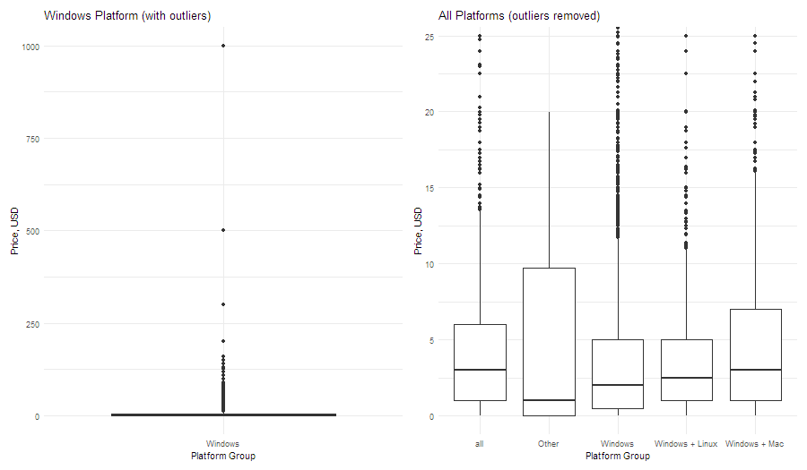
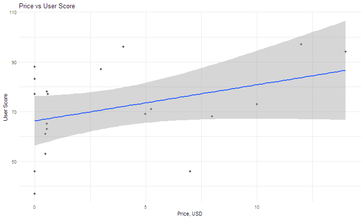

# Student Assignment: Working with Nested JSON Data
## Steam Games Dataset Analysis

An SQL-based analysis of Steam games using DuckDB, exploring game characteristics, user preferences, and platform distributions.

## 📊 Dataset

**Source:** [Steam Games Dataset on Kaggle](https://www.kaggle.com/datasets/fronkongames/steam-games-dataset?select=games.json) \
**Format:** JSON (785 KB)

**Overview** \
The dataset contains comprehensive information about Steam games including:
- Game metadata (name, release date, age requirements)
- Pricing information
- Platform availability (Windows, Mac, Linux)
- User engagement metrics (recommendations, scores, playtime)
- Categorizations (genres, categories, developers)
- Language support

**Structure:** 
- Nested arrays: developers, publishers, genres, categories, supported_languages
- Nested objects: release_date, tags
- Flat fields: price, user_score, platform support (windows, mac, linux)

## 🎯 Project Overview

This project demonstrates SQL data manipulation and analysis techniques using DuckDB, focusing on:
- Data transformation and type casting
- Working with nested/array data structures
- Window functions for ranking and aggregations
- Complex grouping and filtering operations

## 🔍 Analysis Components

### 1. Data Preparation
**File:** `games_part` table creation

Transforms raw JSON data into a structured, typed table with:
- Cleaned string fields (removing quotes) `
- Proper date parsing
- Type conversions (integers, floats, booleans)
- Array fields for nested data (developers, languages, categories, genres)

**Key transformations:**
- Date parsing: `strptime(replace(raw.release_date, '"', ''), '%b %d, %Y')::date`
- String cleaning: `replace(raw.name, '"', '')`
- Type casting: `::int`, `::double`, `::bool`, `::varchar[]`

### 2. Top Games by Category
**Query:** Top 3 games by user score per category

**Techniques used:**
- Array unnesting for `categories`
- Window functions with `PARTITION BY`
- `ROW_NUMBER()` for ranking
- `QUALIFY` clause for filtering ranked results

**Insights:** Family Sharing and Single-player categories have the highest scores (94+)

### 3. Genre Engagement Analysis
**Query:** Average playtime by genre

**Techniques used:**
- Array unnesting for `genres`
- Aggregation with `GROUP BY`
- Rounding for readability

**Insights:** Audio Production and Web Publishing have the highest average playtime (32h and 28h respectively)

### 4. Platform Pricing Analysis
**Query:** Price difference from platform average

**Techniques used:**
- Complex `CASE` statements for platform grouping
- Window functions for calculating group averages
- Computed columns (price difference calculation)

**Insights:** Highest price variation for only Windows platform (900+ USD)

### 5.  Price Distribution by Platform



**Insights:** Windows only group has huge outliers => explains high price variation 

### 6. Price vs Score Relation



**Insights:** There is a positive relation between variables

## 🛠️ Technical Stack

- **Database:** DuckDB
- **Language:** SQL
- **Data Format:** JSON (source)

## 📋 Prerequisites

```bash
# Install DuckDB
# Visit: https://duckdb.org/docs/installation/

# For Python users:
pip install duckdb

# For CLI users:
# Download from https://duckdb.org/
```

## 🚀 Usage

1. **Download the dataset:**
   ```bash
   # Download games.json from Kaggle
   # Place in your working directory
   ```

2. **Load data into DuckDB:**
   ```sql
   -- In DuckDB CLI or your SQL client
   CREATE TABLE games AS 
   SELECT * FROM read_json_auto('games.json');
   ```

3. **Run the analysis queries:**
   - Execute the queries in order as provided in the  [script.sql](script.sql)
   - Each query builds on the transformed `games_part` table


## 🔑 Key SQL Concepts Demonstrated

1. **Array Handling:** Unnesting arrays to perform analysis on nested data
2. **Window Functions:** Partitioned calculations without grouping
3. **Data Cleaning:** String manipulation and type conversions
4. **Complex Aggregations:** Multi-level grouping and ranking
5. **Conditional Logic:** Platform grouping with CASE statements

## 🙏 Acknowledgments

- Dataset provided by [fronkongames on Kaggle](https://www.kaggle.com/fronkongames)
- Built with [DuckDB](https://duckdb.org/) - an in-process SQL OLAP database
- README documentation created with assistance from [Claude.ai](https://claude.ai) - [View conversation](https://claude.ai/share/54ecc0c7-eda6-4bd1-9459-e858a55ac72f)


---

**Note:** This is an analytical project for educational and exploratory purposes. Steam and the Steam logo are trademarks of Valve Corporation.

---


## Theoretical Questions
**Big Data vs Traditional Data Processing** Explain how Big Data differs from traditional data processing systems. Why do data volume, velocity, and distribution fundamentally change system design?
- Big Data is extremely **large** + **complex** datasets ⇒ not enough RAM to work with all of it at once with traditional techniques
- ⇒  need to **divide data** → subsets ⇒  do **parallel** analysis (Healthcare/Retail records)
  - **Volume:** single machine cannot store/process/analyze petabytes+ → need distributed storage and computation
  - **Velocity:** real-time speed of generating and processing → need to process immediately, not in batches
  - **Distribution:** data partitioning → data across many nodes
  
**The 5Vs of Big Data** Interpret the 5Vs (Volume, Velocity, Variety, Veracity, Value). Explain how each V impacts data ingestion, storage, processing, and analytics.
- **Volume:** sheer amount of data generated (terabytes/petabytes+)
  - **Ingestion:** parallel, can handle large-scale datasets
  - **Storage:** distributed storage; horizontal scaling
  - **Processing:** MPP (Massively Parallel Processing)
  - **Analytics:** advanced analytics (ML, predictive modeling)
- **Velocity:** speed at which data is generated + must be processed (real-time/near real-time/weekly)
  - **Ingestion:** stream processing (Apache Kafka)
  - **Storage:** support fast updates
  - **Processing:** real-time/near real-time available; directly in the system's main memory
  - **Analytics:** immediate change in statistics -> reaction
- **Variety:** different formats + types of data (structured, semi-structured, unstructured)
  - **Ingestion:** flexible ingestion pipelines
  - **Storage:** flexible without required schema (Data lakes) or combining different kinds
  - **Processing:** need flexible tools to work with data (NoSQL)
  - **Analytics:** more comprehensive data analysis using different data types
- **+-Veracity:** quality + trustworthiness of data
  - **Ingestion:** can have many errors/noise requiring cleaning/validation
  - **Storage:** metadata storage for additional context for future data manage
  - **Processing:** need data quality checks (schema validation, deduplication)
  - **Analytics:** without cleaning/validating data can distort results
- **+-Value:** actionable insights that can be derived from data
  - **Ingestion:** collect only valuable data + remove outdated
  - **Storage:** remove low-value data
  - **Processing:** optimized for business goals
  - **Analytics:** valuable findings for data-driven approach

**Data Variety and Schema Design** Explain how data variety affects schema design. Why are schema-on-read approaches often used for semi-structured and unstructured data?
- Higher variety call for higher flexibility: traditional schema-on-write cannot capture all data types or makes it hard to work with/imply unnecessary steps (change datatypes for unused columns)
- Schema-on-read approach allows for storage and working with different data without unnecessary steps/errors due to type inconsistency

**Data Types Classification** Classify data into structured, semi-structured, and unstructured. Provide examples of each and explain how they are typically stored and processed.
- **Structured:** highly organised fixed schema with rows and columns
  - `.csv` `.xlsx`
  - stored in relational DBs (MySQL, PostgreSQL), Data Warehouses
  - SQL
- **Semi-structured:** partially organised without fixed schema (hierarchy, key-value pairs)
  - `.json` `.xml`
  - stored in NoSQL DBs (MongoDB), as files
  - may need specialized tools
- **Unstructured:** no predefined schema
  - `.png` `.mp4`
  - stored in Data Lakes, file systems, object storage systems
  - need advanced tools (ML, natural language processing (NLP))

**Processing Semi-Structured Data** Describe common techniques for processing semi-structured data (e.g. JSON, Avro, Parquet). How do analytical databases handle nested data?
- Convert semi-structured data into structured format 
  - Flatten arrays
  - Extract nested fields
  - Schema-on-read
- OLAP stores nested data with ability to unnest or to refer to it when querying

**Massively Parallel Processing (MPP)** Describe MPP architectures. How do they distribute data and parallelize computation? What are the benefits and challenges of this approach?
- Distribute data across nodes with own memory => assign tasks by central coordinator/algorithm => parallel execution => combine results
- Reduce time; can add nodes for better performance; efficient for big data
- Complexity; possible bad data distribution => bad execution

**OLTP vs OLAP Systems** Differentiate OLTP and OLAP workloads in terms of:
- Query patterns
- Typical technologies used
- Data storing

- **OLAP**
  - Complex queries with functions, filtering, joins
  - Snowflake, Amazon Redshift, Google BigQuery
  - Denormalized column-oriented schema; Data warehouses, BI tools
- **OLTP**
  - Simple queries to create, read, update, or delete data
  - MySQL, PostgreSQL, Microsoft SQL Server
  - Normalized row-oriented data in Banking, e-commerce, and inventory management systems


